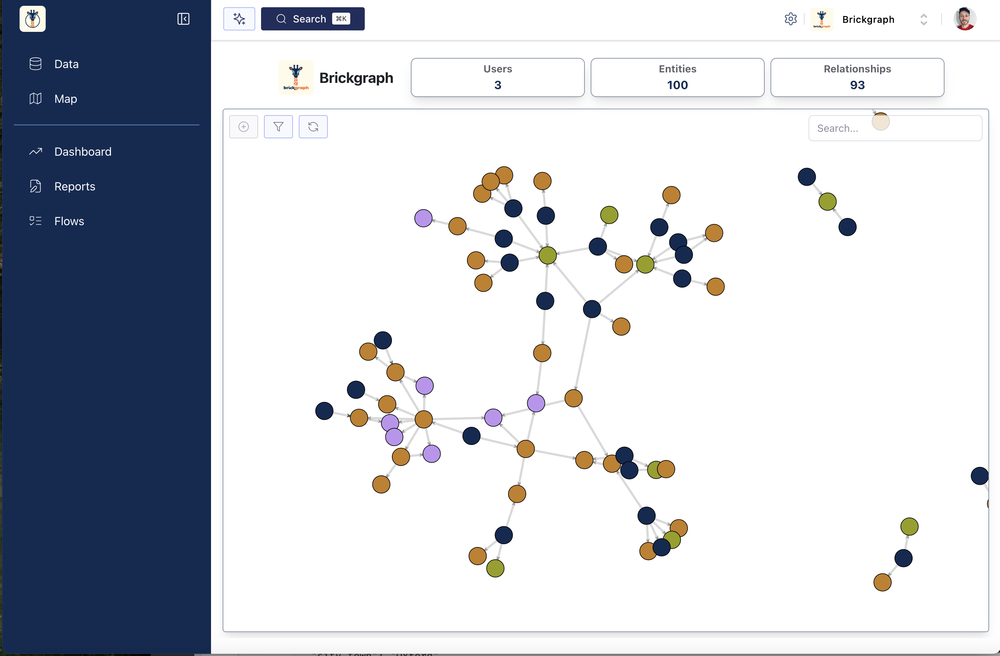
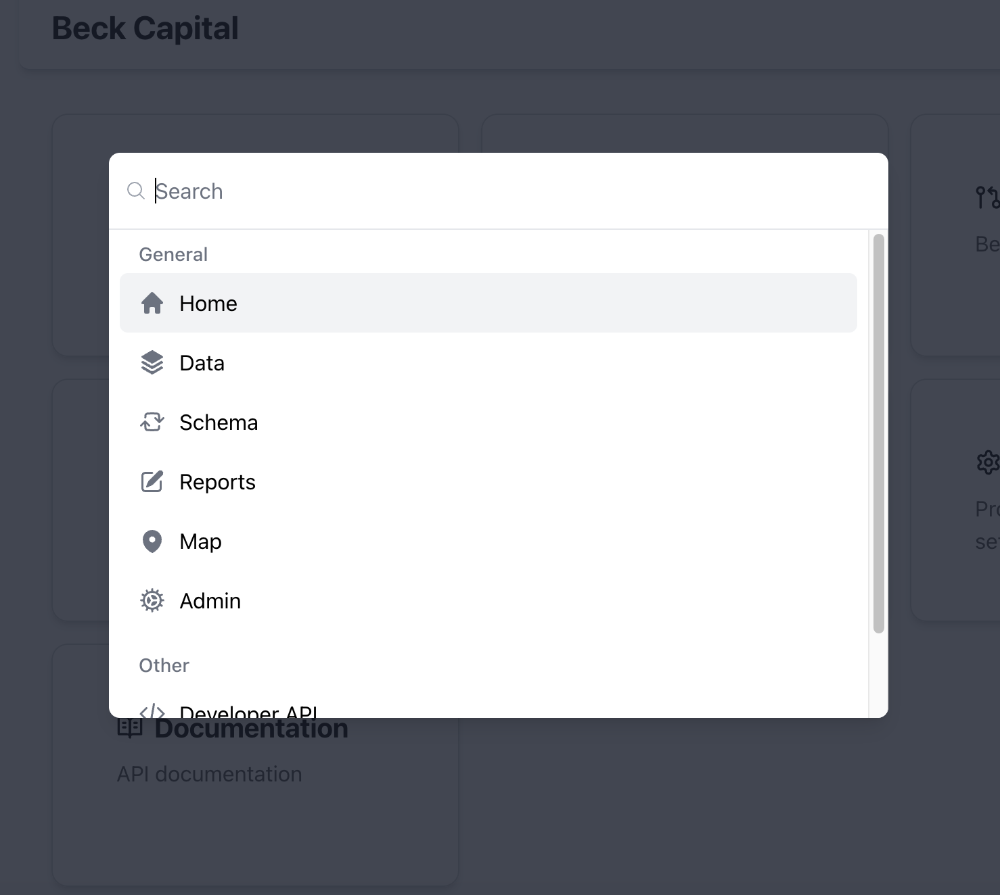

---
hide:
  - navigation
---

# Getting Started with Brickgraph

### Simple and powerful

*Simple, powerful knowledge graphs for ambitious real estate and built environment teams*

Brickgraph makes it easy to create powerful, flexible, and extensible knowledge graphs for your real estate or built environment teams. And, alongside these data capabilities, Brickgraph also offers tools for teams to visualise their data, extract key reports and insights, and leverage maps and geospatial data. We are designed to help ambitious teams take their operations and data to a whole new level.

### Creating an account

Getting up and running is easy. Simply [sign up here](https://app.brickgraph.io)
to start. You'll be prompted to sign in, but if you don't have an account you can click the link
at the bottom of the modal to create one.

### Creating an organisation

### Joining an organisation

### Main navigation page

After signing in you will see the main page.

 

### Quick Search menu

The "Quick search" menu allows you to easily search for specific entity in your organisation's graph or navigate to Brickgraph features or data pages. It is available anywhere you are in the app and allows you to easily navigate to any of the main Brickgraph features. As well, by pressing `ctrl-k on Windows` / `command-k on Mac` - or pressing the button on the side navigation menu - the "Quick search" menu will appear.

 

